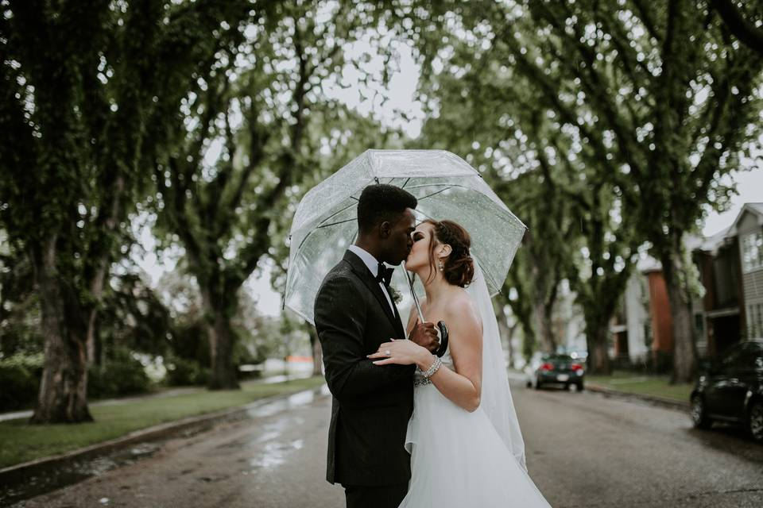
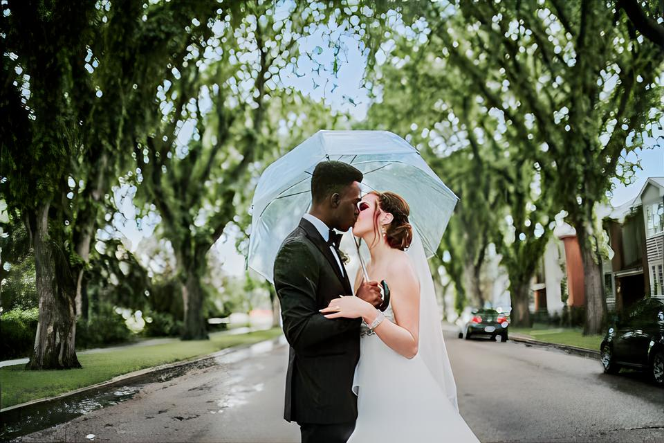
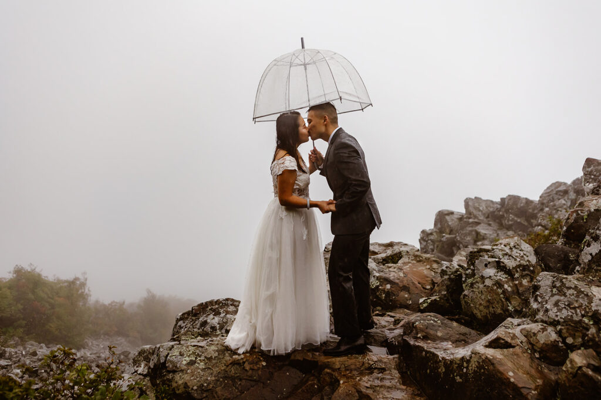
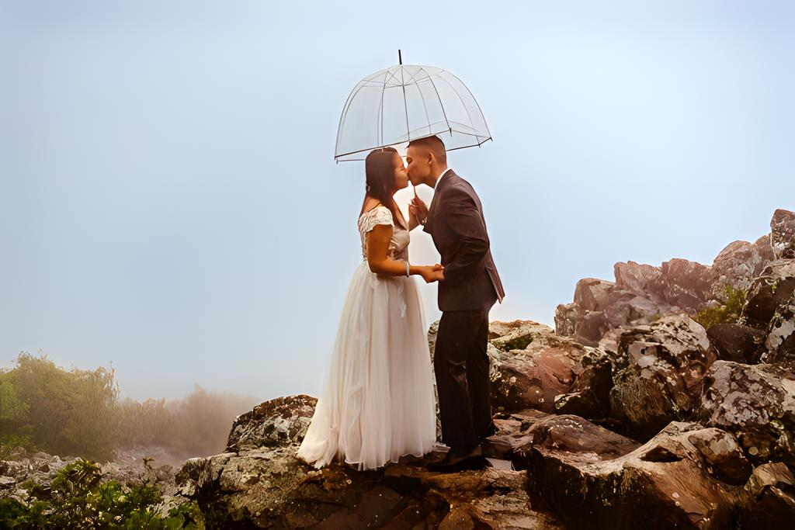

# WeatherGAN

Weather in Vancouver is quite depressing except for Summer. It is either cloudy or rainy for the majority of days in a year. Unfortunately, when I got married, it was a rainy day. I was quite disappointed and thus I decided to train a CycleGAN to convert rainy to clear weather.

| Before                                                           | After                                                            |
| :--------------------------------------------------------------: | :-------------------------------------------------------------: |
| <br>**Before**          | <br>**After**            |
| <br>**Before**           | <br>**After**             |
| <br>**Before**          | <br>**After**            |

This repo contains:
- [CycleGAN-Turbo](https://github.com/GaParmar/img2img-turbo) model that learns to shift weather conditions from unpaired images of cloudy and sunny weather.
- 4x Super-resolution model that upscales the 512x512 output of the CycleGAN
- [Color correction model](https://github.com/davidserra9/namedcurves) that corrects the color of the image to professional standards, trained based on the [PPR10k dataset](https://github.com/davidserra9/PPR10k).


## ✅ Done
- [x] Create custom unpaired dataset for sunny and cloudy weather.
- [x] Train CycleGAN-turbo model
- [x] Add SR model and color correction model to the inference pipeline 

## 🎯 To-do
The result is not pixel perfect. Loss on detail on smaller regions, like small faces, becomes quite obvious when you zoom in. 
Unpaired GAN has advantage in terms of ease of creating dataset, but loss of minor details and some degree of noise is hard to avoid. Paired GANs like Pix2Pix-turbo, on the other hand, would have exact opposite advantage. 

- [ ] Perhaps you can create synthetic dataset by segmenting humans and objects, and swapping the background from cloudy to sunny. Lights could be simulated with re-lighting models to create realistic images.
- [ ] Training paired-GAN could be further improved with patch-based training. This way, we don't have to worry about SR and loss of details from up-sampling.   

# Getting started

Use conda to create an environment and install the dependencies.

```bash
conda env create -f environment.yaml
pip install --upgrade -e .[devel]
```

# Training CycleGAN-Turbo

`CycleGAN-Turbo` is the only model that really needs training from scratch. For other modules, pretrained weights were sufficient.

The model was trained from scratch on privately collected data. This had to be done because the existing rainy-to-sunny CycleGAN models were not generalizing well to cloudy images that have less difference from sunny days. Output was either too noisy, or completely untouched. If you need to access the [data](https://drive.google.com/drive/folders/1oGHsfPpB7GgSxaxmAMTibdk6-r__3Lz3?usp=sharing), please contact me.

The dataset must be configured in this format:

```bash
data
├── dataset_name
│   ├── train_A
│   │   ├── 000000.png
│   │   ├── 000001.png
│   │   └── ...
│   ├── train_B
│   │   ├── 000000.png
│   │   ├── 000001.png
│   │   └── ...
│   └── fixed_prompt_a.txt
|   └── fixed_prompt_b.txt
|
|   ├── test_A
│   │   ├── 000000.png
│   │   ├── 000001.png
│   │   └── ...
│   ├── test_B
│   │   ├── 000000.png
│   │   ├── 000001.png
│   │   └── ...

```

The prompt file is just a single file that contains one line with the prompt (e.g image taken outdoors on a cloudy day).


```bash
accelerate config

export NCCL_P2P_DISABLE=1
accelerate launch --main_process_port 29501 src/weathergan/turbo/train_cyclegan_turbo.py \
    --pretrained_model_name_or_path="stabilityai/sd-turbo" \
    --output_dir="output/cyclegan_turbo/cloudy2sunny" \
    --dataset_folder "data/cloudy2sunny" \
    --train_img_prep "resize_286_randomcrop_256x256_hflip" --val_img_prep "no_resize" \
    --learning_rate="1e-5" --max_train_steps=25000 \
    --train_batch_size=1 --gradient_accumulation_steps=1 \
    --report_to "wandb" --tracker_project_name "gparmar_unpaired_h2z_cycle_debug_v2" \
    --enable_xformers_memory_efficient_attention --validation_steps 250 \
    --lambda_gan 0.5 --lambda_idt 1 --lambda_cycle 1
```

# Inference

Sometimes the output looks worse with curve correction. In that case, add `--no_curve_correction` flag. sr_algorithm can be set to `diffusion` or `realesrgan`.

```bash
# inference by model name
python inference.py --model_name "rainy_to_clear" --input_image data/cloudy/sequences/val/frames/sequence924/sequence924_frame154224_info.png --output_dir "outputs"

# inference by model path
python inference.py --model_path "output/cyclegan_turbo/checkpoints/model_10501.pkl" --prompt "image taken outdoors on a sunny day" --direction "a2b" --input "samples/cloudy" --output_dir "outputs"
```

